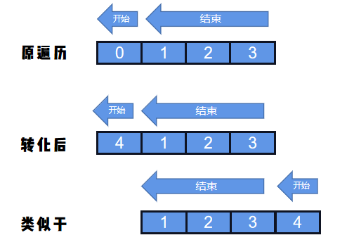

### 解题思路
其实就是看向左走，向右走，哪个快。
* 1、首先，确定``start``和``right``，哪个在左，哪个在右，直接比较大小就好了。
* 2、然后，主要就是向左走有个边界问题要判断，咱么可以通过取余的方法避免这个问题，
即把``left``改为`` left + distance长度``

这样就可以把左边那几个距离，``放``到右边去了，递减遍历就OK了。


但是``distance``里面没有``distance[4]``啊，只要给他取模就好了：
```
distance[4 % 4] = distance[0]
```
### 代码

```golang
func distanceBetweenBusStops(distance []int, start int, destination int) int {
	if start > destination {
		start, destination = destination, start
	}
	l2r, r2l := 0, 0
	for i := start; i < destination; i++ {
		l2r += distance[i]
	}
	ld := len(distance)
	for i := start + ld -1;i >= destination; i-- {
		r2l += distance[i % ld]
	}
	return int(math.Min(float64(l2r), float64(r2l)))
}
```