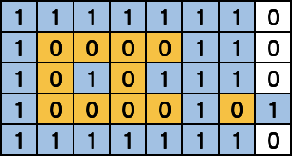

其实主要思路就是要认识到：
```
碰不到边缘的陆地才是孤岛
```

顺便附送一张修正后的题目用图，蓝色为海洋，黄色为孤岛，白色为非孤岛陆地


## 广度优先遍历
### 解题思路

* 1. 使用广度优先遍历
* 2. 对于每一块陆地，找到它的所有连接陆地，把走过的陆地都置为海洋，防止重复遍历
* 3. 如有陆地在地图边缘上，那么这一片陆地就无法构成孤岛；否则，这一次广度遍历结束后，孤岛数量+1

### 代码

```go
func closedIsland(grid [][]int) int {
	num, rowNum,colNum := 0, len(grid), len(grid[0])
	dir := [][]int{{-1,0},{0,1},{1,0},{0,-1}}
	for row, v1 := range grid {
		for col, v2 := range v1 {
			if v2 == 1 {
				continue
			}
			closed := true
			queue := [][]int{{row, col}}
			// 如果有在边缘的陆地，则不能构成封闭
			if row == 0 || row == rowNum-1 || col == 0 ||col == colNum-1 {
				closed = false
			}
			for len(queue) != 0 {
				head := queue[0]
				queue = queue[1:]
				for _, v := range dir {
					newRow, newCol := head[0] + v[0], head[1] + v[1]
					if newRow <0 || newRow >= rowNum || newCol <0 || newCol >= colNum {
						continue
					}
					if grid[newRow][newCol] == 1 {
						continue
					}
					// 如果有在边缘的陆地，则不能构成封闭
					if newRow == 0 || newRow == rowNum-1 || newCol == 0 ||newCol == colNum-1 {
						closed = false
					}
					queue = append(queue,[]int{newRow, newCol})
					grid[newRow][newCol] = 1
				}
			}
			if closed {
				num++
			}
		}
	}
	return num
}
```

## 深度优先遍历
### 解题思路

1. 使用深度优先遍历
2. 对于每一块陆地，向四面扩展，找到他的所有连接陆地，如果所有方向到最后都是海洋，则构成孤岛，数量+1

记得把走过的陆地都置为海洋，防止重复遍历


### 代码
```go
func closedIsland(grid [][]int) int {
	num, rowNum, colNum := 0, len(grid), len(grid[0])
	for row, v1 := range grid {
		for col, v2 := range v1 {
			if v2 == 1 {
				continue
			}
			// 如果满足四面环水，则孤岛数量+1
			if dfs(grid, rowNum, colNum, row, col) {
				num++
			}
		}
	}

	return num
}

func dfs(grid [][]int, rowNum, colNum, row int, col int) (b bool) {
	// 如果触碰到边界了，无法构成孤岛
	if row < 0 || col < 0 || row >= rowNum || col >= colNum {
		return false
	}
	// 如果碰到水了，返回正确
	if grid[row][col] == 1 {
		return true
	}
	// 经过的地方置为海洋
	grid[row][col] = 1
	// 需要四个方向都环水
	up := dfs(grid, rowNum, colNum, row-1, col)
	down := dfs(grid, rowNum, colNum, row+1, col)
	left := dfs(grid, rowNum, colNum, row, col-1)
	right := dfs(grid, rowNum, colNum, row, col+1)
	return up && down && left && right
}
```
