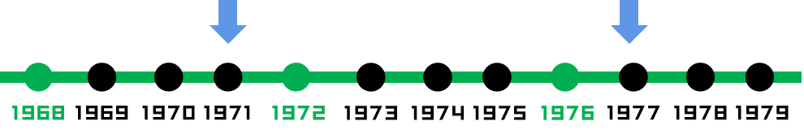

> 原题链接：[1360. 日期之间隔几天](https://leetcode-cn.com/problems/number-of-days-between-two-dates/)
### 解题思路
* 1、分别算出两个日期距离``1997-1-1``日距离
* 2、算出两个距离的差距
#### 关于闰年的天数计算
其中要注意闰年时候，要多算天数,计算方法如下：
```
1. 先加上所有模 4 为 0 的年份的数量。此时有些模 100 为 0 的不是闰年的年份被加上了。
2. 再减去所有模 100 为 0 的年份的数量。此时有些模 400 为 0 的是闰年的年份被减去了。
3. 再加上所有模 400 为 0 的年份的数量。完成。
```
写成代码就是
```go
res += (year-1)/4 - 1971/4
res -= (year-1)/100 - 1971/100
res += (year-1)/400 - 1971/400
```
上面的语句，可不可以写成下面这样子呢？
```go
res += (year-1-1971)/4
```
答案是不可以，因为

咱们看``1977``年和``1971``年之前其实有两个闰年，但是如果按照``(1977-1971)/4``算，就只有一个闰年了，这就不对了。

### 代码
```go
func daysBetweenDates(date1 string, date2 string) int {
	date1Arr := strings.Split(date1, "-")
	date2Arr := strings.Split(date2, "-")
	year1, _ := strconv.Atoi(date1Arr[0])
	month1, _ := strconv.Atoi(date1Arr[1])
	day1, _ := strconv.Atoi(date1Arr[2])
	year2, _ := strconv.Atoi(date2Arr[0])
	month2, _ := strconv.Atoi(date2Arr[1])
	day2, _ := strconv.Atoi(date2Arr[2])
	return int(math.Abs(float64(dayDistance(year1, month1, day1) - dayDistance(year2, month2, day2))))
}

func dayDistance(year, month, day int) int {
	monthDays := []int{0, 31, 28, 31, 30, 31, 30, 31, 31, 30, 31, 30, 31}
	// 当月的天数差
	res := day - 1
	// 每月的天数差
	for month != 0 {
		month--
		res += monthDays[month]
		if month == 2 && isLeapYear(year) {
			res += 1
		}
	}
    // 每年的天数差
	res += 365 * (year - 1971)
    res += (year-1)/4 - 1971/4
    res -= (year-1)/100 - 1971/100
    res += (year-1)/400 - 1971/400
	return res
}

func isLeapYear(year int) bool {
	return year%400 == 0 || (year%4 == 0 && year%100 != 0)
}
```
