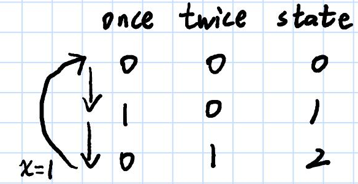

# 137. 只出现一次的数字 II
## 位运算
### 解题思路
逢3就变0，那么可以把数字认为是三个状态的状态机，即
```
00 -> 01 -> 10 -> 00
```
因为一共有三个状态，所以我们需要用两个变量来表示状态。
* 1）用``once``表示是否在状态 1
* 2）用 twice 来表示是否在状态 2 。

那么两个变量都为 0 就表示在状态 0 。然后可以得到如下的状态转移表：


### 代码
```golang
func singleNumber(nums []int) int {
	var one, two int
	for _, num := range nums {
		one = ^two & (one ^ num)
		two = ^one & (two ^ num)
	}
	return one
}
```

## 逐位考虑
### 解题思路
### 代码
统计所有数字中每个位中1出现的总数

那么对于某个位，1出现的次数一定是3的倍数+1或0，
那么对这个数``%3``得到的结果就是目的数字在该位上的值


### 代码
```golang
func singleNumber(nums []int) int {
	result := 0
	for i := 0; i < 64; i++ {
		// 初始化每一位1的个数为0
		sum := 0
		for _, v := range nums {
			// 通过右移i位的方式，计算每一位1的个数
			sum += v >> i & 1 // 得到该位的数字
		}
		// 最终将抵消后剩余的1放到对应的位数上
		result |= (sum % 3) << i
	}
	return result
}
```

## 哈希计数
### 解题思路
兜底解法，不符合题目要求，用了额外空间
### 代码
```golang
func singleNumber(nums []int) int {
	m := make(map[int]int)
	for _, k := range nums {
		//如果是其他语言，请注意对应的判空操作！ 
		m[k]++
	}
	for k, v := range m {
		if v == 1 {
			return k
		}
	}
	return 0
}
```

## 数学方式
### 解题思路
``[AAABBBCCC]``和``[AAABBBC]``相差了两个``C``
```
3×(a b c)−(a a a b b b c)=2c
```
也就是说把原数组去重，再乘以3得到的值，刚好就是咱们要找的数的2倍
### 代码
懒得写go的了，直接复制了python版本，反正这个方法面试不符合要求...
```python
class Solution:
    def singleNumber(self, nums: List[int]) -> int:
        return int((sum(set(nums)) * 3 - sum(nums)) / 2)
```