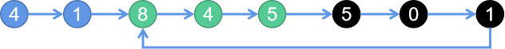

# 160. 相交链表

> 原题链接：[160. 相交链表](https://leetcode-cn.com/problems/intersection-of-two-linked-lists/)

## 解法一：首尾相接法
### 解题思路


将这两个链表首尾相连，然后检测这个链表是否存在环，如果存在，则两个链表相交，而环入口结点即为相交的结点



### 代码
```go
func getIntersectionNode(headA, headB *ListNode) *ListNode {
	if headA == nil || headB == nil {
		return nil
	}
	curA := headA
	// 找到A的尾节点
	for curA.Next != nil {
		curA = curA.Next
	}
	// 将A尾巴和B头相连
	curA.Next = headB
	// 用快慢指针找到环的相交点
	slow, fast := headA, headA
	for fast != nil && fast.Next != nil {
		slow, fast = slow.Next, fast.Next.Next
		if slow == fast {
			break
		}
	}
	// 无相交点可以直接返回了
	if slow != fast {
		curA.Next = nil
		return nil
	}
	slow = headA
	for slow != fast {
		slow, fast = slow.Next, fast.Next
	}
	// 树的结构不能改变，这里做还原
	curA.Next = nil
	return slow
}
```
## 解法二：尾结点法
### 解题思路
如果两个链表相交，那么两个链表从相交点到链表结束都是相同的结点，必然是``Y``字形

所以，判断两个链表的最后一个结点是不是相同即可。


* 1、即先遍历一个链表，直到尾部
* 2、再遍历另外一个链表，如果也可以走到同样的结尾点，则两个链表相交
* 3、这时记下两个链表的长度``lenA``、``lenB``
* 4、再遍历一次，长链表结点先出发前进``abs(lenA-lenB)``步
* 5、之后两个链表同时前进，每次一步，相遇的第一点即为两个链表相交的第一个点
```go
func getIntersectionNode(headA, headB *ListNode) *ListNode {
	if headA == nil || headB == nil {
		return nil
	}
	curA, curB := headA, headB
	lenA, lenB := 0,0
	// 遍历headA/headB,找到其尾节点，并得到其长度
	for curA.Next != nil {
		curA = curA.Next
		lenA++
	}
	for curB.Next != nil {
		curB = curB.Next
		lenB++
	}
	// 尾巴都不相等，肯定不相交
	if curA != curB {
		return nil
	}
	// 让长的那个链表先行差距步数
	if lenA > lenB {
		for lenA - lenB > 0 {
			headA = headA.Next
			lenA--
		}
	}
	if lenB > lenA {
		for lenB - lenA > 0 {
			headB = headB.Next
			lenB--
		}
	}
	// 之后两者同时前行就可以得到相交位置
	for headA != headB {
		headA, headB = headA.Next, headB.Next
	}
	return headA
}
```

##
### 解题思路

解决这个问题的关键是，通过某些方式，让 p1 和 p2 能够同时到达相交节点 c1。

所以，我们可以让 p1 遍历完链表 A 之后开始遍历链表 B，让 p2 遍历完链表 B 之后开始遍历链表 A，这样相当于「逻辑上」两条链表接在了一起。

如果这样进行拼接，就可以让 p1 和 p2 同时进入公共部分，也就是同时到达相交节点 c1：


### 代码
```go
func getIntersectionNode(headA, headB *ListNode) *ListNode {
	// p1 指向 A 链表头结点，p2 指向 B 链表头结点
	p1, p2 := headA, headB
	for p1 != p2 {
		// p1 走一步，如果走到 A 链表末尾，转到 B 链表
		if p1 == nil {
			p1 = headB
		} else {
			p1 = p1.Next
		}
		
		// p2 走一步，如果走到 B 链表末尾，转到 A 链表
		if p2 == nil {
			p2 = headA
		} else {
			p2 = p2.Next
		}
	}
	return p1
}
```