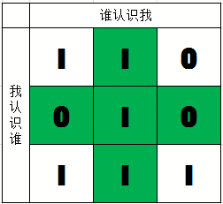

# 277. 搜寻名人
>> ## 天下何人不识君
> 原题链接：[277. 搜寻名人](https://leetcode-cn.com/problems/find-the-celebrity/)

本题思路很简单，就是用排除法，排除没有名人资格的人。


经过下面两种考验，剩下的就是有资格的了：
```
考验1： 不能认识别人
考验2： 别人不能不认识你
```


代码如下
```go []
/**
 * The knows API is already defined for you.
 *     knows := func(a int, b int) bool
 */
func solution(knows func(a int, b int) bool) func(n int) int {
	return func(n int) int {
		for i := 0; i < n; i ++ {
			for j := 0; j < n; j++ {
				// 如果i认识别人就失去名人资格
				if knows(i, j) && i != j {
					break
				}
				// 如果别人不认识i，i失去名人资格
				if !knows(j, i) {
					break
				}
				// 挺过上面的考验，到达最后一人时，你就是名人啦
				if j == n -1 {
					return i
				}
			}
		}
		return -1
	}
}
```