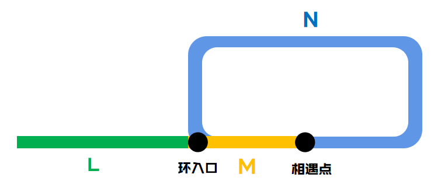

> 原题链接：[287. 寻找重复数](https://leetcode-cn.com/problems/find-the-duplicate-number/)

## 解法一、二分法
### 解题思路
这一题可以用二分法，乍一看有点反常规，一般来说，二分法不是求数字大小在不在某个范围吗？
这一题，咱们可以求小于某个数字的数量，是否在某个范围。

比如说，正常来说``left:1 ~ right:4``范围内应该有的数数量为``4``,``1/2/3/4``嘛。
但是如果有重复数字的话，就不一样了，可能是``1/2/2/3/4```，变``5``个了，很明显当某个范围内数量反常的多时，说明重复数字就在其中。

类似的，当某个范围内数量反常的少时，说明重复数字被分到另一半去了，占了这个范围内数字的名额。
### 代码
```go
func findDuplicate(nums []int) int {
	l := len(nums)
	left, right := 1, l-1
	for left < right {
		mid, count := (left+right) >> 1, 0
		for _, v := range nums {
			if v <= mid {
				count++
			}
		}
		if count > mid {
			right = mid
		} else {
			left = mid+1
		}
	}
	return left
}
```
## 解法二、快慢指针法
### 解题思路
* 1、``nums``数字中如果没有重复数字的话，那么应该能组成一个类似链表的结构，比如
```
nums = [1,3,4,2]

```
可以按照索引和值对应关系，组成
```
0 -> 1
1 -> 3
2 -> 4
3 -> 2
```
从索引0出发，用其对应的值``nums[0]``作为下一个索引，可以组成类似链表的序列
```
0 -> 1 -> 3 -> 2 -> 4
```
* 2、``nums``数字中如果有重复数字的话，那么应该能组成一个类似``有环链表``的结构，比如
```
nums = [1,3,4,2,2]

```
可以按照索引和值对应关系，组成
```
0 -> 1
1 -> 3
2 -> 4
3 -> 2
4 -> 2
```
从索引0触发，用其对应的值``nums[0]``作为下一个索引，可以组成类似链表的序列
```
0 -> 1 -> 3 -> 2 -> 4 -> 2 -> 4 ....
```
可以看出从``2->4``开始，无限循环了

* 3、下面让我们找到这个环，用快慢指针法，快指针走两步，慢指针走一步，就像一男一女在跑道上跑步，虽然快慢不一，但是两个人迟早会在环里相遇

### 代码
针对下面的代码做两点讲解：
* 1、为啥找到了两个人的相遇点，还要继续找，不能直接返回吗？

因为两个人在环里相遇了，不一定就在入环的口（就是重复的数字那儿），有可能在环内，这一步只是为了找到环入口。

一男一女，从图书馆自习结束后，不约而同的去操场跑步，虽然男生跑的快一点，但是两个人会在跑道里某一点相遇，但是，这个点不一定非得是操场到跑道的入口吧。

* 2、为啥找到环内相遇点后，用下面的代码就一定能找到入口？
```go
slow = 0  
for slow != fast {
    slow, fast = nums[slow], nums[fast]
}
```
这里需要一点点推导：


如上图，相遇时候
* 1）女生走的距离为``L + M``
* 2）男生走的距离为``L + M + N + M``

因为男生走的比女生快一倍，所以可以得到
```
L+M+N+M == 2 * (L+M)   =>  L == N
```
所以，让女生回到出发的地方，男生在相遇点以和女生相同一样的速度继续沿着环走，两人会在跑道入口相遇。

因为距离和速度都相同，剩下的交给时间咯。


下面是代码
```go
func findDuplicate(nums []int) int {
	slow, fast := 0, 0
	slow, fast = nums[slow], nums[nums[fast]]
	// 进入环内
	for slow != fast {
		slow, fast = nums[slow], nums[nums[fast]]
	}
	slow = 0  
	// 找到环的入口
	for slow != fast {
		slow, fast = nums[slow], nums[fast]
	}
	return fast
}
```
