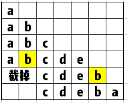

# 截取法
> 原题链接：[3. 无重复字符的最长子串](https://leetcode-cn.com/problems/longest-substring-without-repeating-characters/)
## 解法一、遇到重复的字母，就从上次出现的地方开始截取
### 解题思路
1、遍历``s``，用``curStr``存储当前拼接的字符串
2、如果当前的字母，在``curStr``里已经出现过，先看看当前字符串是不是最长的了，
然后直接从该字母上次出现的地方截取当前字符串，然后在后面加上当前的字符


3、遍历结束，返回最大长度就好了
### 代码
```golang
func lengthOfLongestSubstring(s string) int {
	result, curStr := 0, ""
	for _, v := range s {
		curChar := string(v)
		index := strings.Index(curStr, curChar)
		if index != -1 {
			length := len(curStr)
			if length > result {
				result = length
			}
			curStr = curStr[index+1:]
		}
		curStr += curChar
	}
	if len(curStr) > result {
		return len(curStr)
	}
	return result
}
```
如果不让用系统函数的话，也可以用哈希表来记录用过的字符
```golang
func lengthOfLongestSubstring(s string) int {
	m, result, cur := make(map[int32]int), 0, 0
	for k, v := range s {
		if value, ok := m[v]; ok {
			for i := k-cur; i < value; i++ {
				delete(m, int32(s[i]))
			}
			cur = k - value
			m[v] = k
			continue
		}
		m[v] = k
		cur++
		if cur > result {
			result = cur
		} 
	}
	return result
}
```
## 解法二，滑动窗口
### 解题思路
1、用``m``记录已经用过的字符，``left/right``分别是当前窗口左右边界
2、每次向右移动一格``left``，因为之前的``left``字母移出窗口了，所以需要从``m``去掉
3、然后观察``right``，``right``右移动的时候碰到在``m``里出现的字符，就可以停止了，记录左右边界间的距离

注意，这时候的``right``的字母是不能加入字符串的，加入就重复字母了，所以长度是``right-left``，没有``+1``

4、``left``移动结束后，看看最大长度是多少
### 代码
```go []
func lengthOfLongestSubstring(s string) int {
	// 哈希集合，记录每个字符是否出现过
	m , l := make(map[byte]bool), len(s)
	// 右指针，初始值为 -1，相当于我们在字符串的左边界的左侧，还没有开始移动
	right, result := 0, 0
	for k := range s {
		if k != 0 {
			// 左指针向右移动一格，移除一个字符
			delete(m, s[k-1])
		}
		for right < l && !m[s[right]] {
			// 不断地移动右指针
			m[s[right]] = true
			right++
		}
		// 第 i 到 rk 个字符是一个极长的无重复字符子串
		result = max(result, right - k)
	}
	return result
}
func max(x, y int) int {
	if x < y {
		return y
	}
	return x
}
```


