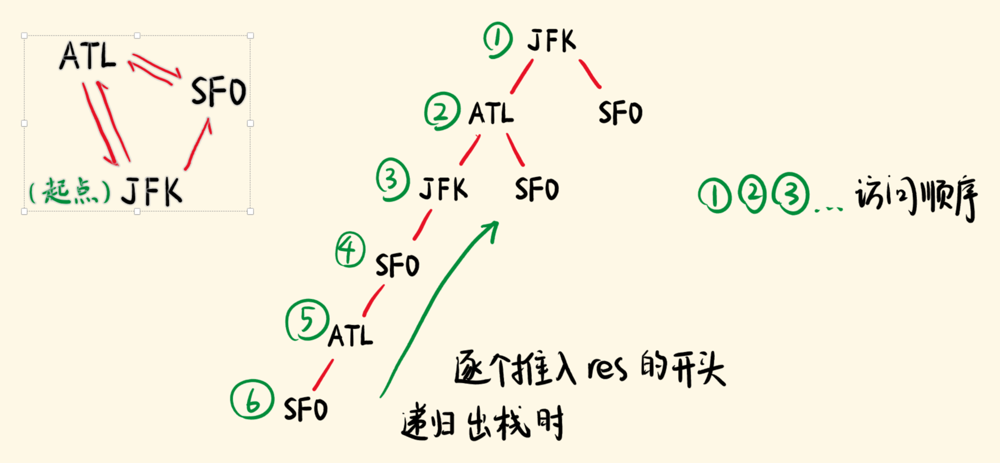

# 332. 重新安排行程
> 原题链接：[332. 重新安排行程](https://leetcode-cn.com/problems/reconstruct-itinerary/)

### 解题思路
如果一张图中，从一个点出发可以走完所有的边，则这个遍历走过的路径就叫``欧拉路径``，可以理解成一张图可以一笔画出来。

已知图中存在欧拉路径，你要找出一个欧拉路径，可以用``hierholzer``算法。

* 任选一个点为起点（题目把起点告诉你了），遍历它所有邻接的边（设置不同的分支）。
* DFS 搜索，访问邻接的点，并且将走过的边（邻接关系）删除。
* 如果走到的当前点，已经没有相邻边了，则将当前点推入 res。
* 随着递归的出栈，点不断推入 res 的开头，最后就得到一个从起点出发的欧拉路径。


### 代码
```go
func findItinerary(tickets [][]string) []string {
	var (
		nextCities = map[string][]string{} // 票通往的下一个城市
		result     []string
	)
	for _, ticket := range tickets {
		from, to := ticket[0], ticket[1]
		nextCities[from] = append(nextCities[from], to)
	}
	// 按照城市名称排序
	for key := range nextCities {
		sort.Strings(nextCities[key])
	}
	var dfs func(curCity string)
	dfs = func(curCity string) {
		for {
			if v, ok := nextCities[curCity]; !ok || len(v) == 0 {
				break
			}
			// DFS 搜索，访问邻接的点，并且将走过的边（邻接关系）删除
			nextCity := nextCities[curCity][0]
			nextCities[curCity] = nextCities[curCity][1:]
			dfs(nextCity)
		}
		// 如果走到的当前点，已经没有相邻边了，则将当前点推入 res
		result = append(result, curCity)
	}
	// 都从JFK开始遍历
	dfs("JFK")
	// 得到的结果是逆序的，所以需要倒序排列下
	for i := 0; i < len(result)/2; i++ {
		result[i], result[len(result) - 1 - i] = result[len(result) - 1 - i], result[i]
	}
	return result
}
```
