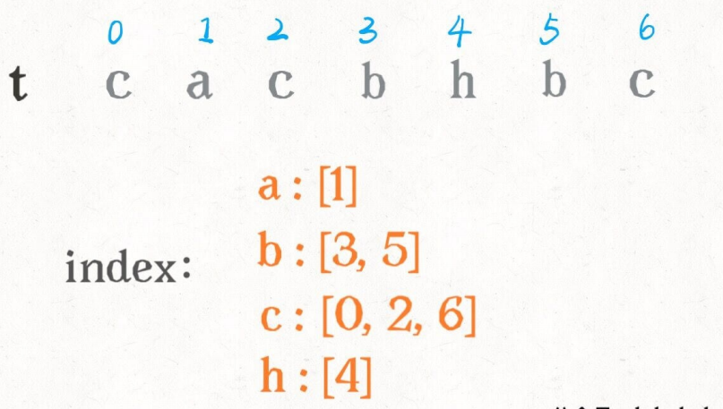

# 392. 判断子序列
> 原题链接：[392. 判断子序列](https://leetcode-cn.com/problems/is-subsequence/)
## 双指针法
### 解题思路
* 1、两个指针，一个指向``s``的头``i``，一个指向``t``的头``j``
* 2、向右移动``j``以遍历``t``，每当发现``s[i]==t[j]``，右移一次``i``
* 3、如果最后发现``i``移动到``s``末尾了，说明匹配成功
### 代码
```go
func isSubsequence(s string, t string) bool {
	ls, lt := len(s), len(t)
	i, j := 0, 0
	for ; i < ls && j < lt; {
		if s[i] == t[j] {
			i++
		}
		j++
	}
	return i == ls
}
```
## 二分法
### 解题思路
⼆分思路主要是对 t 进⾏预处理，⽤⼀个字典 index 将每个字符出现的 索引位置按顺序存储下来

⽐如对于这个情况，匹配了 "ab"，应该匹配 "c" 了

我们需要 j 线性前进扫描字符 "c"，但借助 index 中记 录的信息，可以⼆分搜索 index[c] 中⽐ j ⼤的那个索引
### 代码
