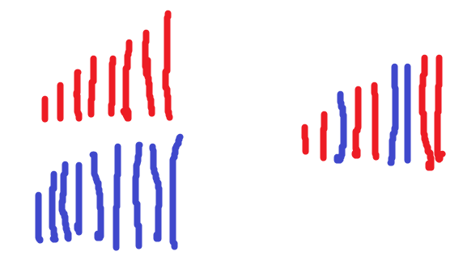

中学时候老师排座位是男女各排成一队，然后依次从两队选人进教室就坐，差不多就是按照从矮到高坐的。最矮的坐在最前面，最高的坐在最后面。

我们的做法类似，但是我们不需要让所有同学都入座，只要找到中间身高那个人(或者两个人)就好。
## 主要逻辑
逻辑为：
1、 当男女队伍都有人的时候：
如果男队当前排头比女队排头高，则让这个男生出列，排头变成下一个男生（女队情况类似）
2、当女队已经没有人的时候（男队情况类似）：
只要排男队就好了，按顺序依次出列就好了
3、如果出列的人已经达到了一半，最近出列的那个人就是中位数了
## 注意奇偶数情况
需要注意的是，要针对总人数为奇偶数情况，中位数的判断也不一样，比如：
1、总数5个人，中位数计算为
5/2 = 2; 2+1=3
也就是第三个人单人的身高

2、总数6个人，中位数计算为
6/2 = 3;
也就是3/4两个人的身高平均数
## 代码
提供我的代码，仅供参考：

```go []
func findMedianSortedArrays(nums1 []int, nums2 []int) float64 {
	l1 := len(nums1)
	l2 := len(nums2)
	halfNum := (l1 + l2) / 2
	i := 0
	j := 0
	mid1 := 0
	mid2 := 0
	curEle := 0
	for i+j < halfNum+1 {
		if i == l1 {
			curEle = nums2[j]
			j++
		} else if j == l2 {
			curEle = nums1[i]
			i++
		} else if nums1[i] > nums2[j] {
			curEle = nums2[j]
			j++
		} else {
			curEle = nums1[i]
			i++
		}
		if halfNum*2 == l1+l2 {
			if i+j == halfNum {
				mid1 = curEle
			} else if i+j == halfNum+1 {
				mid2 = curEle
			}
		} else {
			if i+j == halfNum+1 {
				mid1 = curEle
				mid2 = curEle
			}
		}
	}
	return (float64(mid1) + float64(mid2)) / 2
}
```
