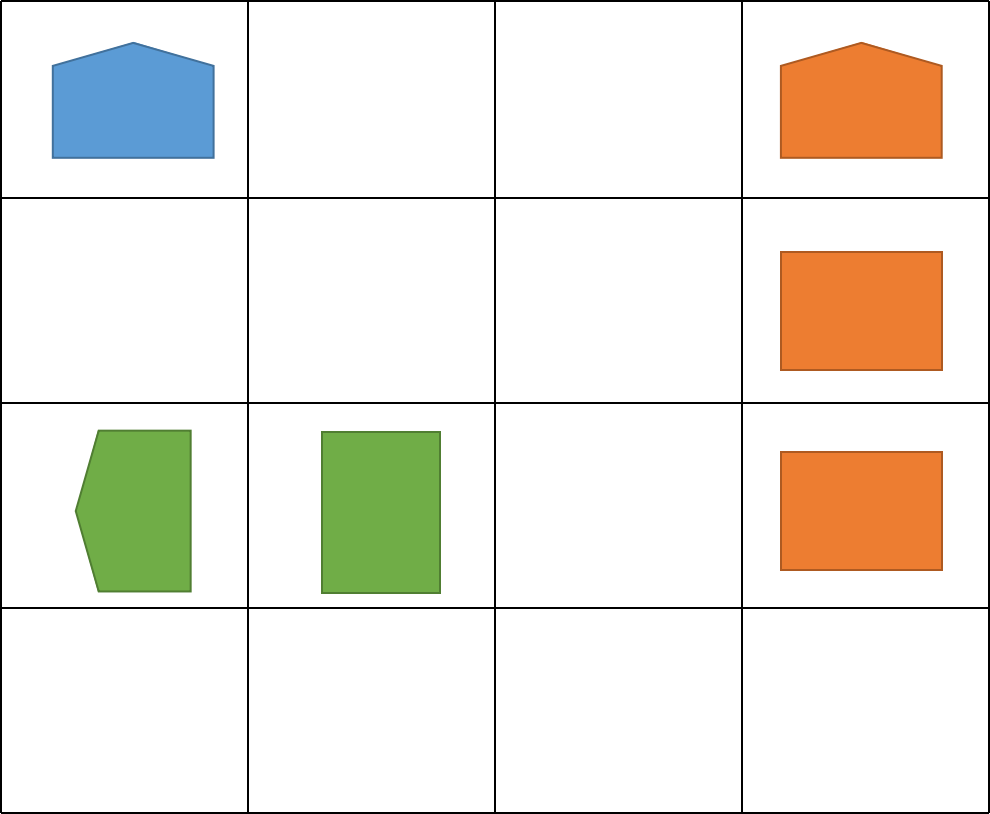

# 广度遍历 和 进阶做法
## 广度遍历
### 解题思路
* 1. 找到``X``后，就上下左右搜罗其身体其他部分，置为``.``
* 2. 看看能找到多少个这样的``X``
### 代码

```golang
func countBattleships(board [][]byte) int {
	num, rowNum, colNum := 0, len(board), len(board[0])
	// 只扫描右边和下边就好了，因为左和上肯定已经被扫描过了
	dir := [][]int {{1,0},{0,1}}
	for row, v1 := range board {
		for col, v2 := range v1 {
			if v2 == "."[0] {
				continue
			}
			num++
			queue := [][]int{{row, col}}
			for len(queue) != 0 {
				top := queue[0]
				queue = queue[1:]
				for _, v := range dir {
					newRow, newCol := top[0] + v[0], top[1] + v[1]
					if newRow >= rowNum || newRow < 0 || newCol >= colNum || newCol <0 {
						continue
					}
					if board[newRow][newCol] == "."[0] {
						continue
					}
					queue = append(queue, []int{newRow, newCol})
					board[newRow][newCol] = "."[0]
				}
			}
		}
	}
	return num
}
```
## 进阶做法


就是找到军舰的“船头”
* 1. 遍历``board``数组
* 2. 如果是``.``，跳过
* 3. 如果是``X``，且左边或者上边也是``X``，说明当前是其他军舰的一部分，跳过
* 4. 如果是``X``，且左边或者上边都不是``X``，说明是新军舰的船头，计数``num``+1
* 5. 返回计数``num``即可

```golang
func countBattleships(board [][]byte) int {
	num := 0
	for row, v1 := range board {
		for col, v2 := range v1 {
			if v2 == "."[0] {
				continue
			}
			if row > 0 && board[row-1][col] == 'X' {
				continue
			}
			if col > 0 && board[row][col-1] == 'X' {
				continue
			}
			num++
		}
	}
	return num
}
```