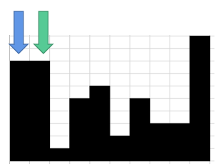
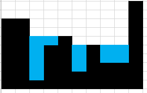

# 遇到坑就填，直到无坑可填
> 原题链接：[42. 接雨水](https://leetcode-cn.com/problems/trapping-rain-water/)

### 解题思路
#### 核心思想
找到柱子中间的所有坑，然后用雨水填上
#### 具体操作
那么坑怎么找呢？我们可以这么做：
* 1、设定一个左指针``left``(蓝色箭头)，再在其后一个位置设定一个右指针``right``(绿色箭头)，将``left``认为是坑的左顶点



* 2、依次向右边移动``right``，一旦发现right指向的柱子有降低趋势了，说明就形成了一个坑，把降低前的那个柱子设为坑的右顶点


* 3、将左右顶点看成是水桶的两边围栏，能装多少水，取决于较短的那根，比如较短值``lowerHeight``，所以轮询两根柱子之间的柱子，求其与
``lowerHeight``差值就好。

其实，你可以**把两根柱子看做是水桶两边围栏，中间的柱子看成是水桶凹凸不平的底**，是不是就好理解了？

* 4、然后把``right``柱子设为``left``，再重复``2/3``步，直到``right``抵达到最后一根柱子


* 5、好了，事情没有结束，第一遍循环走完了，得到了下面这张图



很明显，还有地方可以放水，我们可以把刚才填过水的地方认为是柱子了，再重新执行``1/2/3/4``步，就可以得到下面的图


* 6、重复执行第5步，直到无坑可填，咱们的运算就结束了


### 代码

```golang
func trap(height []int) int {
	l := len(height)
	sum := 0
	for true {
		left := 0
		right := 1
		curSum := 0
		for right < l {
			// 出现先增加，后减少的情况，直接可以计算一次储水了
			if right+1 >= l || (height[right-1] <= height[right] && height[right+1] < height[right]) {
				lowerHeight := int(math.Min(float64(height[left]), float64(height[right])))
				if lowerHeight != 0 {
					for j := left + 1; j < right; j++ {
						if lowerHeight < height[j] {
							continue
						}
						curSum += lowerHeight - height[j]
						height[j] = lowerHeight
					}
				}
				left = right
				right = left + 1
			} else {
				right++
			}
		}
		if curSum == 0 {
			break
		} else {
			sum += curSum
		}
	}
	return sum
}
```