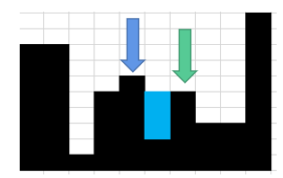

# 遇到坑就填，直到无坑可填
> 原题链接：[42. 接雨水](https://leetcode-cn.com/problems/trapping-rain-water/)
## 依次填坑法
这是我第一次做这个题想到的方法，后来比较了大佬们的解法，发现还是太晦涩，太复杂了，不好。
### 解题思路
#### 核心思想
找到柱子中间的所有坑，然后用雨水填上
#### 具体操作
那么坑怎么找呢？我们可以这么做：
* 1、设定一个左指针``left``(蓝色箭头)，再在其后一个位置设定一个右指针``right``(绿色箭头)，将``left``认为是坑的左顶点


* 2、依次向右边移动``right``，一旦发现right指向的柱子有降低趋势了，说明就形成了一个坑，把降低前的那个柱子设为坑的右顶点


* 3、将左右顶点看成是水桶的两边围栏，能装多少水，取决于较短的那根，比如较短值``lowerHeight``，所以轮询两根柱子之间的柱子，求其与
``lowerHeight``差值就好。

其实，你可以**把两根柱子看做是水桶两边围栏，中间的柱子看成是水桶凹凸不平的底**，是不是就好理解了？

* 4、然后把``right``柱子设为``left``，再重复``2/3``步，直到``right``抵达到最后一根柱子



* 5、好了，事情没有结束，第一遍循环走完了，得到了下面这张图


很明显，还有地方可以放水，我们可以把刚才填过水的地方认为是柱子了，再重新执行``1/2/3/4``步，就可以得到下面的图


* 6、重复执行第5步，直到无坑可填，咱们的运算就结束了


### 代码

```golang
func trap(height []int) int {
	l := len(height)
	sum := 0
	for true {
		left := 0
		right := 1
		curSum := 0
		for right < l {
			// 出现先增加，后减少的情况，直接可以计算一次储水了
			if right+1 >= l || (height[right-1] <= height[right] && height[right+1] < height[right]) {
				lowerHeight := int(math.Min(float64(height[left]), float64(height[right])))
				if lowerHeight != 0 {
					for j := left + 1; j < right; j++ {
						if lowerHeight < height[j] {
							continue
						}
						curSum += lowerHeight - height[j]
						height[j] = lowerHeight
					}
				}
				left = right
				right = left + 1
			} else {
				right++
			}
		}
		if curSum == 0 {
			break
		} else {
			sum += curSum
		}
	}
	return sum
}
```

以下内容全部参考了``labuladong``大佬的[如何高效解决接雨水问题](http://labuladong.gitbook.io/algo/gao-pin-mian-shi-xi-lie/jie-yu-shui)

## 暴力法
### 解题思路
每一条柱子能存储多少水取决于其左右最高的柱子。

就像木桶的两边一样，又取决于相对较短的那一根。

### 代码
```golang
func trap(height []int) int {
	l := len(height)
	result := 0
    memoLeft, 
	for i := 1; i < l-1; i++ { // 最左边和最右边的柱子可没法存水
		leftMax, rightMax := 0, 0
		for j := i; j < l; j++ {
			if height[j] > rightMax {
				rightMax = height[j]
			}
		}
		for j := i; j >= 0; j-- {
			if height[j] > leftMax {
				leftMax = height[j]
			}
		}
		if leftMax > rightMax {
			result += rightMax - height[i]
		} else {
			result += leftMax - height[i]
		}
	}
	return result
}
```

## 加上备忘录的暴力法
### 解题思路
上面的方法提交后，只能击败8%的老铁了，这是我们不忍心看到的，能不能改善下呢？

可以，其实我们对于一根柱子左右的最高柱子，反复求了多次。
不如提前全部求好，存在备忘录里，后面用到直接取用即可。
### 代码
```golang
func trap(height []int) int {
	l := len(height)
	if l == 0 { // 注意特判
		return 0
	}
	maxLeftArr, maxRightArr := make([]int, l), make([]int, l)
	maxLeftArr[0], maxRightArr[l-1] = height[0], height[l-1]
	for i := 1; i < l; i++ {
		maxLeftArr[i] = int(math.Max(float64(height[i]), float64(maxLeftArr[i-1])))
	}
	for i := l - 2; i >= 0; i-- {
		maxRightArr[i] = int(math.Max(float64(height[i]), float64(maxRightArr[i+1])))
	}
	result := 0
	for i := 1; i < l-1; i++ {
		result += int(math.Min(float64(maxLeftArr[i]), float64(maxRightArr[i]))) - height[i]
	}
	return result
}
```

## 双指针法
### 解题思路
``lMax``是``left``指针左边的最高柱子，但是``rMax``并不一定是``left``指针右边最高的柱子，这样和上面是不一样的，
还可以得到正确答案吗？

可以，不用管``rMax``是不是右边最长的，因为一个桶能装多少水和比较短的木板有关，在``lMax < rMax``的情况下，
``height[i]`` ``能够装的水只和``l_max``这根较短的边有关。
### 代码
```golang
func trap(height []int) int {
	l := len(height)
	if l == 0 { // 注意特判
		return 0
	}
	left, right, lMax, rMax, result := 0, l-1, height[0], height[l-1], 0
	for left < right {
		if height[left] > lMax {
			lMax = height[left]
		}
		if height[right] > rMax {
			rMax = height[right]
		}
		if lMax < rMax {
			result += lMax - height[left]
			left++
		} else {
			result += rMax - height[right]
			right--
		}
	}
	return result
}
```

## 韦恩图法
### 解题思路
这种解法太秀了，我是想不出来的，解法见这位大佬的。
[数学解法，我秀我自己](https://leetcode-cn.com/problems/trapping-rain-water/solution/wei-en-tu-jie-fa-zui-jian-dan-yi-dong-10xing-jie-j/)
### 代码
```golang
func trap(height []int) int {
	area1, area2, max1, max2 := 0, 0, 0, 0
	l := len(height)
	sum := 0
	for i := 0; i < l; i++ {
		if height[i] > max1 {
			max1 = height[i]
		}
		if height[l-1-i] > max2 {
			max2 = height[l-1-i]
		}
		area2 += max1
		area2 += max2
		sum += height[i]
	}
	return area1 + area2 - max1*l - sum
}
```