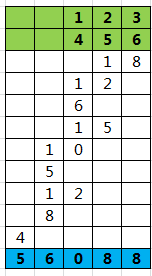

# 切分乘法
### 解题思路
一看到这题，第一想法就是把字符串转成数字，然后相乘。

但是这样的题目应该不会被列为中等吧...

于是想到：

将每一位数分别转为数字，相乘后，再乘以位数的偏移量


写出下面这样的代码：

```golang
func multiply(num1 string, num2 string) string {
	l1, l2, sum := len(num1), len(num2), 0
	zeroASCII := int("0"[0])
	for i := l1 - 1; i >= 0; i-- {
		multi := int(math.Pow(10, float64(l1-1-i)))
		digit1 := int(num1[i]) - zeroASCII
		if digit1 == 0 {
			sum += 0
			continue
		}
		for j := l2 - 1; j >= 0; j-- {
			digit2 := int(num2[j]) - zeroASCII
			sum += digit1 * digit2 * multi
			multi *= 10
		}
	}
	return strconv.Itoa(sum)
}
```
死在这个测试用例上了，越界
```
输入：
"498828660196"
"840477629533"
输出：
"-3269442614257959980"
预期：
"419254329864656431168468"
```

只好进一步优化：
每一位分别计算乘积，累加后，将10取余的数字存下，其余向前进位，重复此过程


### 代码

```golang
func multiply(num1 string, num2 string) string {
	l1, l2 := len(num1), len(num2)
	zeroASCII := int("0"[0])
	if (l1 == 1 && int(num1[0]) == zeroASCII) || (l2 == 1 && int(num2[0]) == zeroASCII) {
		return "0"
	}
	arr := make([]int, l1+l2)
	for k1, v1 := range num1 {
		digit1 := int(v1) - zeroASCII
		for k2, v2 := range num2 {
			digit2 := int(v2) - zeroASCII
			t, index := digit1*digit2, l1-1-k1+l2-1-k2
			arr[index] += t % 10
			arr[index+1] += t / 10 // 如果乘积超过10
		}
	}
	result, extra := "", 0
	for k, v := range arr {
		t := v + extra
		// 如果第一位是0，无需记入
		if k == l1+l2-1 && t == 0 {
			continue
		}
		result = strconv.Itoa(t%10) + result
		extra = t / 10 // 进位
	}
	return result
}
```