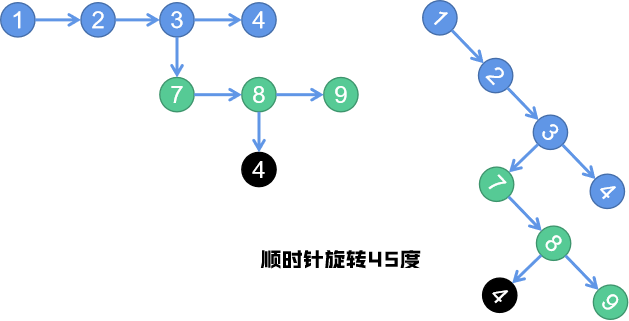

# 430. 扁平化多级双向链表
> 原题链接：[430. 扁平化多级双向链表](https://leetcode-cn.com/problems/flatten-a-multilevel-doubly-linked-list/)

## 栈方法
### 解题思路
* 1、该链表的遍历，以``child``中节点优先，即优先往下走，然后是``Next``节点，即次之往右走。
* 2、在往下走的时候，咱们可以把暂时挂起的``Next``节点放到栈内
* 3、等到下边的都走完了，咱们就可以走右边了
* 4、等到右边的走完了，就去看看栈内挂起的``Next``节点还有没有，有的话，继续
* 6、等到发现下边，右边，栈都没了，说明遍历结束了
### 代码
```golang
func flatten(root *Node) *Node {
	cur := root // 当前节点
	var stack []*Node
	for cur != nil {
		// 如果当前节点有子节点，优先往下走
		if cur.Child != nil {
			if cur.Next != nil { // 挂起的右边节点入栈
				stack = append(stack, cur.Next)
			}
			cur.Child.Prev = cur
			cur.Next = cur.Child
			cur.Child = nil
		}
		if cur.Next != nil {
			cur = cur.Next
			continue
		}
		// 如果没有后续节点了，而且栈也空了，可以认为遍历结束了
		if len(stack) == 0 {
			break
		}
		next := stack[len(stack)-1]
		stack = stack[:len(stack)-1]
		cur.Next = next
		next.Prev = cur
		cur = next
	}
	return root
}
```

## 递归法
### 解题思路
* 1、该链表的遍历，以``child``中节点优先，即优先往下走，然后是``Next``节点，即次之往右走。
* 2、在没有``Child``的情况下，直接往右走就好了
* 3、在有``Child``的情况下，就可以用到递归了，把子节点们先铺平了得到``flatChild``，然后接在当前节点``Cur``后面；

在铺平``Cur``子节点的时候，一定要记得把其``Child``置为``nil``

* 4、此外，由于得到的铺平子节点``flatChild``是它的头，我们这时候想要把``Cur``的``Next``接在后面，
就要依次访问``flatChild``得到其最后一个节点，然后将``Next``接在后面

### 代码
```golang
func flatten(root *Node) *Node {
	if root == nil {
		return nil
	}
	cur := root
	for cur != nil {
		if cur.Child == nil {
			cur = cur.Next
			continue
		}
		// 存在子链表，递归
		next := cur.Next
		flattenChild := flatten(cur.Child)
		cur.Next = flattenChild
		flattenChild.Prev = cur
		cur.Child = nil // 不要忘记置空child！
		// 连接原来的next
		if next != nil {
			for cur.Next != nil {
				cur = cur.Next
			}
			cur.Next = next
			next.Prev = cur
		}
		cur = cur.Next
	}
	return root
}
```
## 先序遍历
###  解题思路



* 1、可以把这种带子节点的链表，看成是歪过来的二叉树。
* 2、咱们按照先序遍历的方式，得到所有节点
* 3、再将所有节点连成链表
### 代码
```golang
func flatten(root *Node) *Node {
	list = []*Node{}
	dfs(root)
	l := len(list)
	for k, v := range list {
		if k + 1 < l {
			v.Next = list[k+1]
		}
		if k > 0 {
			v.Prev = list[k-1]
		}
		v.Child = nil
	}
	return root
}

// 存储所有节点的数组
var list []*Node
func dfs(root *Node) {
	if root == nil {
		return
	}
	list = append(list, root)
	dfs(root.Child) // 类似于遍历二叉树左节点
	dfs(root.Next)  // 类似于遍历二叉树右节点
}
```