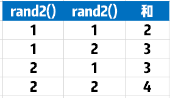
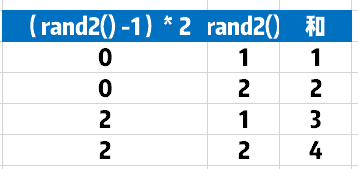

# 470. 用 Rand7() 实现 Rand10()
> 原题链接：[470. 用 Rand7() 实现 Rand10()](https://leetcode-cn.com/problems/implement-rand10-using-rand7/)

### 解题思路
看到这题，年轻的我想到了这么做，``rand7()``十次，再除以7，不就得到``1-10``的随机数了吗？
```go
func rand10() int {
	sum := 0
	for i := 0; i < 10; i++ {
		sum += rand7()
	}
	return sum / 7
}
```
然而结果是不对....

因为得到的每个数字并不是等概率的，用``rand2()``举例，咱们想用其得到``rand4()``：



我们可以观察到，存在两个问题：
* 1）结果不是从1到4
* 2）结果的分布是不均匀的，产生``3``的概率达到了``50%``!因为组成``3``的方式比较多

咱们对加数的前者做一下变动



神奇的事情发生了，奇怪的知识增加了。通过这样的处理，得到的结果恰是``[1,4]``的范围，
并且每个数都是等概率取到的。因此，使用这种方法，可以通过rand2()实现rand4()。

推广一下，可以得到
```
已知 rand_N() 可以等概率的生成[1, N]范围的随机数
那么：
(rand_X() - 1) × Y + rand_Y() ==> 可以等概率的生成[1, X * Y]范围的随机数
即实现了 rand_XY()
```

* 1、``rand7()``函数返回1到7的随机数，那么``rand7()-1``则得到一个离散整数集合，该集合为{0，1，2，3，4，5，6}，该集合中每个整数的出现概率都为1/7。
* 2、那么```(rand7()-1)*7``得到另一个离散整数集合A，该集合元素为7的整数倍，即``A={0，7，14， 21，28，35，42}``，其中，每个整数的出现概率也都为1/7。
* 3、而由于``rand7()``得到的集合``B={1，2，3，4，5，6，7}``，其中每个整数出现的概率也为``1/7``。
* 4、显然集合A与集合B中任何两个元素和组合可以与``1～49``之间的一个整数一一对应，即``1～49``之间的任何一个数，
可以唯一地确定A和B中两个元素的一种组合方式，这个结论反过来也成立。
* 5、由于集合A和集合B中元素可以看成是独立事件，根据独立事件的概率公式``P(AB)=P(A)P(B)``，得到每个组合的概率是``1/7*1/7=1/49``。
* 6、因此，``(rand7()-1)*7+rand7()``生成的整数均匀分布在``1～49``之间，而且，每个数的概率都是``1/49``。

### 代码
```go
func rand10() int {
	for {
		num := (rand7() - 1) * 7 + rand7() // 等概率生成[1,49]范围的随机数
		if num <= 40 {
			return num % 10 + 1  // 拒绝采样，并返回[1,10]范围的随机数
		}
	}
}
```
但是上面这样有个缺乏，因为浪费了``41``到``49``的数字，咱们可以利用起来：
```go

func rand10() int {
	for {
		num := (rand7() - 1) * 7 + rand7() // 等概率生成[1,49]范围的随机数
		if num <= 40 {
			return num % 10 + 1  // 拒绝采样，并返回[1,10]范围的随机数
		}
		
		num = num - 40 // rand 9
		num = (num-1)*7 + rand7() // rand 63
		if num <= 60 {
			return num % 10 + 1
		}
		
		num = num - 60 // rand 3
		num = (num-1)*7 + rand7() // rand 21
		if num <= 20 {
			return num % 10 + 1
		}
	}
}
```
