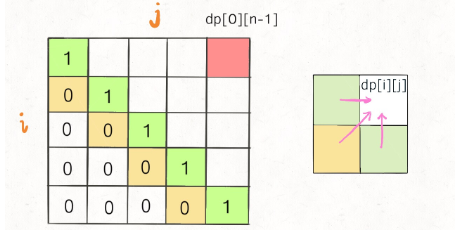

## 动态规划法
### 解题思路
根据状态转移方程，想求``dp[i][j]``需要知道``dp[i+1][j-1]``，``dp[i+1][j]``，``dp[i][j-1]`` 这三个位置；



再看看我们确定的 base case，填入 dp 数组之后是这样：

为了保证每次计算``dp[i][j]``，左下右方向的位置已经被计算出来，只能斜着遍历或者反着遍历：

### 代码
```golang
func longestPalindromeSubseq(s string) int {
	l := len(s)
	// memo 数组全部初始化为 0
	memo := make([][]int, l)
	// base case
	for k := range memo {
		memo[k] = make([]int, l)
	}
	// 反着遍历保证正确的状态转移
	for left := l - 1; left >= 0; left-- {
		memo[left][left] = 1
		for right := left + 1; right < l; right++ {
			// 状态转移方程
			if s[left] == s[right] {
				memo[left][right] = memo[left+1][right-1] + 2
			} else {
				// s[i+1..j] 和 s[i..j-1] 谁的回文子序列更长？
				memo[left][right] = int(math.Max(float64(memo[left+1][right]), float64(memo[left][right-1])))
			}
		}
	}
	// 整个 s 的最长回文子串长度
	return memo[0][l-1]
}
```