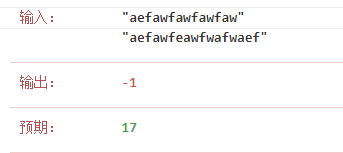

### 解题思路
当我看到下面这个测试用例的时候，我才知道我之前写那么复杂是想多了



如果``b``字符串比``a``长，

那么``a``永远无法组成``b``了，

``b``用其本身作为最长特殊序列就好了，

长度就是较长的字符串``b``的长度。
### 代码

```golang
func findLUSlength(a string, b string) int {
	if a == b {
		return -1
	}
	return int(math.Max(float64(len(a)), float64(len(b))))
}
```