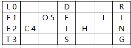

# 将字符串分组求余就好啦，优点是容易理解
> 原题链接：[6. Z 字形变换](https://leetcode-cn.com/problems/zigzag-conversion/)
## 解法一、索引取余法
### 解题思路
分析分布的形状就可以得到，可以将字符串按照指定长度切割，比如，当``numRows=4``的时候，指定长度``listNum``为：
```
listNum = numRows*2 -2 = 4 * 2 - 2 = 6
 ```

 
这么一来就好做了，用字符串索引依次除以``listNum``即``6``，余数``left``的情况为：
 ```
 0：落在第0行
 1：落在第1行
 2：落在第2行
 3：落在第3行
 4：落在第2行，也就是 6-4
 5：落在第1行，也就是 6-5
 ```
 看出规律了嘛
 * 1、当余数``<numRows``的时候，该字符落在第``left``行。
 * 2、当余数``>=numRows``的时候，该字符落在第``listNum - left``行。
 
 所以我们可以创建一个N行的字符串数组，用来存放字符。这样一来，遍历完字符串后，依次将每一行的结果拼接就好了。
 ### 代码
 
 ```go
func convert(s string, numRows int) string {
	if numRows == 1 {
		return s
	}
	listNum, result := numRows*2 - 2, make([]string, numRows)
	for k, v := range s {
		left := k % listNum
		if left >= numRows - 1 {
			left = listNum - left
		}
		result[left] += string(v)
	}
	return strings.Join(result, "")
}
 ```

## 解法二、flag变换法
### 解题思路
### 代码
观察下图，可以发现，给定行数为``numRows``的情况,比如``4``时候，字符串``s``：

* 1）在索引``0``到``numsRows-1``的时候，比如``0-3``，行数会依次增大，落在``0 ~ nums-1``行
* 2）在索引``numsRows-1``到``numsRows*2 - 1``的时候，比如``3-6``，行数会依次减小，落在``nums-1 ~ 0``行

其实也就是行数变成``0``的时候，行数会逐渐增大；行数变成``nums-1``的时候，行数会逐渐减小。

所以咱们设置一个``flag``，每当触发上面的边界时候，``flag``在``-1/1``间变换，这样就实现了增大/减小变换。


```go
func convert(s string, numRows int) string {
	if numRows < 2 {
		return s
	}
	i , flag, res := 0, -1, make([]string, numRows)
	for _, v := range s {
		res[i] += string(v)
		if i == 0 || i == numRows - 1 {
			flag = -flag
		}
		i += flag
	}
	return strings.Join(res, "")
}
```
