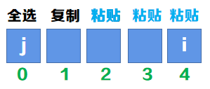

# 651. 4键键盘
> ## 只有Key1/4才增加A
> 原题链接：[651. 4键键盘](https://leetcode-cn.com/problems/4-keys-keyboard/)

### 解题思路
根据题意
```
Key 1: (A)：在屏幕上打印一个 'A'。
Key 2: (Ctrl-A)：选中整个屏幕。
Key 3: (Ctrl-C)：复制选中区域到缓冲区。
Key 4: (Ctrl-V)：将缓冲区内容输出到上次输入的结束位置，并显示在屏幕上。
```
真正能够引起``A``的数目发生变化的其实是 ``Key 1: (A)`` 还有  ``Key 4: (Ctrl-V)``。

假设第``i``次时候，最多的``A``数量是``best[i]``，那么接下来第``i+1``次时候：
* 1）如果选择``key2``或者``key3``，第``i+1``次数量不变，还是``best[i]``
* 2）如果选择``key1``时，第``i+1``次数量为``best[i] + 1``
* 3）如果选择``key4``时候，第``i+1``次数量为？暂时不确定，因为我们并不知道缓存区的``A``有多少，也就是我们不知道到底从哪儿开始一路复制粘贴的。
那么我们就从之前的某次``best[j]``里找，看看从哪个``j``开始复制能得到最大的``i+1``次A数量

如果要复制粘贴，那么咱们至少留下2次操作给``全选``和``复制``，所以``j <= i -2``，而粘贴的次数应该是``i-j-1``


根据这个思路写下代码就好了。

### 代码

```go
func maxA(N int) int {
	best := make([]int, N+1)
	for i := 1; i <= N; i++ {
		// 如果這一次采用(A)的話
		best[i] = best[i-1] + 1
		// 如果采用的是 (Ctrl+V) 的话
		for j := 0; j <= i-2;j++ {
			best[i] = int(math.Max(float64(best[i]), float64(best[j] * (i-j-1))))
		}
	}
	return best[N]
}
```
