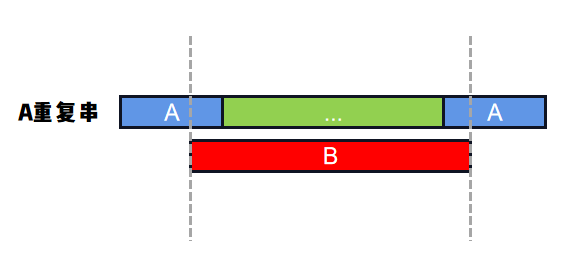

# 最大长度2A+B
### 解题思路
如果``A``重复一定次数后，能够让``B``成为其子串，
那么我们只要将``t``从空字符串开始，不断拼接``A``，就必定能让让``B``成为其子串，就像这样：
```
t = A + A + A + A ...
t.contains(B)
```

但是什么时候停止呢？
当``t``长度超过``len(A)*2 + len(B)``时，就可以结束了。

为什么呢？因为满足条件的``A``重复串，必定是下面这个样子，即



即``B``头部用到``A``的后一部分，尾部用到了``A``的前一部分，如蓝色部分所示；
而中间绿色部分必然比``B``短，所以：
```
总长度 < len(A) * 2 + B
```

### 代码

```go
func repeatedStringMatch(A string, B string) int {
	la, lb := len(A), len(B)
	maxLen := la * 2 + lb
	t, count := "", 0
	for len(t) < maxLen {
		if strings.Contains(t, B) {
			return count
		}
		t += A
		count++
	}
	return -1
}
```
