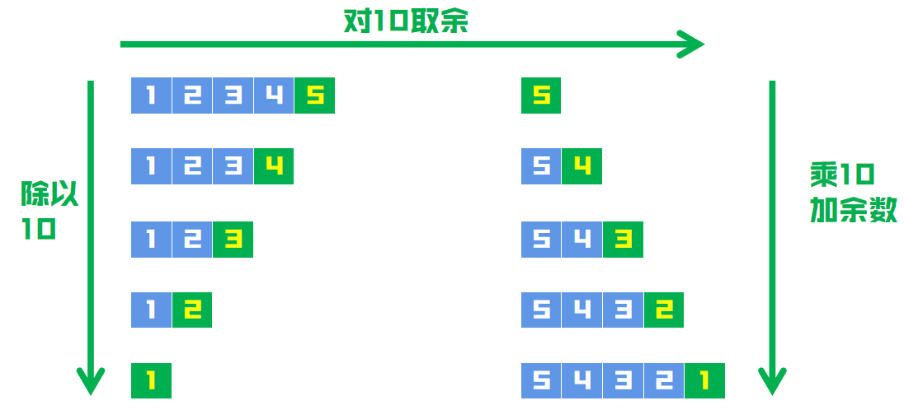

## 注意边界
### 解题思路
这题主要注意下数字的边界就可以了。


* 1、不断通过``x``除10，使位数左移动，即个>十>百>千>万
* 2、对当前``x``取余，获取当前位的数字
* 3、使用当前位的数字，拼接颠倒的数字

注意``越界``就可以了，即结果不能大于``MaxInt32``，也不能小于``MinInt32``

### 代码
```go
func reverse(x int) int {
	result := 0
	for x != 0 {
		result = result*10 + x%10
		x = x / 10
	}
	if result > math.MaxInt32 || result < math.MinInt32 {
		return 0
	}
	return result
}
```

## 改进做法：
### 解题思路
咱们也可以提前把越界问题判断好，在嗅到越界的味道时候，就直接返回。

比如为了防止超过最大值``MaxInt32``，咱们上面每一步做法不都是吗？
```go
result = result*10 + x%10
```
* 1）如果``result``乘10之前的数字就超过``MaxInt32 / 10``了，乘以10后，必定超了
* 2）如果``result``乘10之前的数字等于``MaxInt32 / 10``，但是``x/10 > 7``，那肯定也要超了，因为``2^31 - 1``最后一位数就是``7``

类似的，为了防止小于最小值``MinInt32``

* 1）如果``result``乘10之前的数字就小于``MinInt32 / 10``了，乘以10后，必定更小
* 2）如果``result``乘10之前的数字等于``MinInt32 / 10``，但是``x/10 < -8``，那肯定也要更小了，因为``-2^31``最后一位数就是``-8``


### 代码
```go
func reverse(x int) int {
	result, mod := 0, 0
	for x != 0 {
		mod, x = x % 10, x / 10
		if result > math.MaxInt32 / 10 || (result == math.MaxInt32 / 10 && mod > 7) ||
			result < math.MinInt32 / 10  || (result == math.MinInt32 / 10 && mod < -8) {
			return 0
		}
		result = result*10 + mod
	}
	return result
}
```
