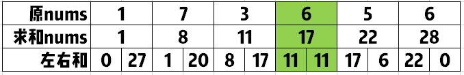

## 累加后求左右值
### 解题思路


1、遍历``nums``,每个未知的``nums[i]``等于前面数的和加上自身
2、再次遍历修改后的``nums``：
这时候对于``nums[i]``来说，左边数的和就是``nums[i-1]``，右边数的和就是``nums[l-1] - nums[i]``
3、咱们只要寻找是否存在这样的``i``，使得
```
nums[i-1] == nums[l-1] - nums[i]
```
当然了，要特殊考虑``i``等于0的情况，因为这时候``i-1``小于0，所以这时候左边值得就是0，右边值就是``nums[l-1] - nums[0]``，
如果``nums[l-1] - nums[0] == 0``，就可以直接返回``0``了。
### 代码

```golang
func pivotIndex(nums []int) int {
	l := len(nums)
	if l == 0 {
		return -1
	}
	for i := 1; i < l;i++ {
		nums[i]+= nums[i-1]
	}
	if nums[l-1] - nums[0] == 0 {
		return 0
	}
	for i := 1; i < l;i++ {
		if nums[i-1] == nums[l-1] - nums[i] {
			return i
		}
	}
	return -1
}
```
## 上面的思路变解
### 解题思路
1、咱们也可以先求得所有数的和，比如为``sum``
2、然后再次遍历``nums``，每轮到一个数字就求当前的累加和``curSum``乘以2后，再加上当前数，是否和``sum``一样，也就是
```
curSum * 2 + nums[i] == sum
```
如果相等，说明当前数字左边的数之和=右边的数之和，满足条件

### 代码
```golang
func pivotIndex(nums []int) int {
	var sum int
	for _, v := range nums {
		sum += v
	}
	var curSum int
	for k, v := range nums {
		if curSum*2+v == sum {
			return k
		}
		curSum += v
	}
	return -1
}
```

