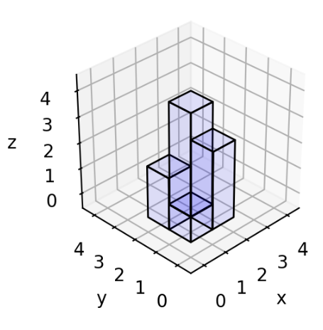
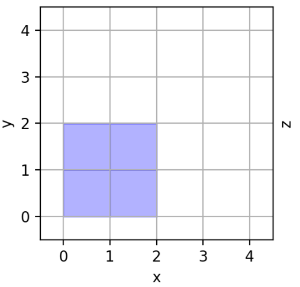
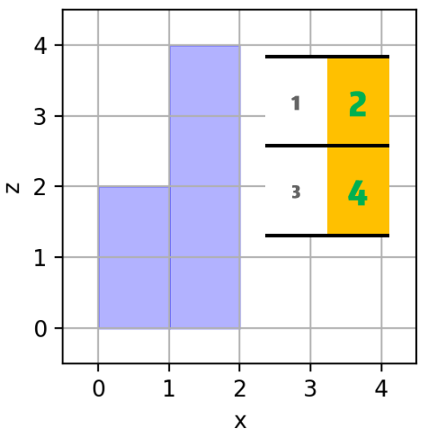
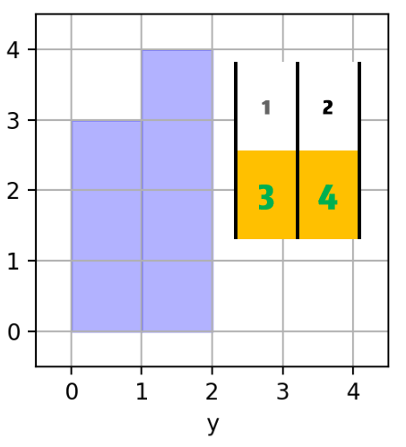

# 三面投影的规则
### 解题思路
我感觉这道题做不出来的话，应该很大关系和图太小有关系....我们观察下图：

其输入为
```
[
	[1,2],
	[3,4]
]
```


* 1、其在``xy``面上的投影是：


即只要输入不为``0``的地方都有面积为``1 * 1``的投影

* 2、其在``xz``面上的投影是：


即每一``行``最大的值，会相应的形成面积为``max(row) * 1``的投影

* 3、其在``yz``面上的投影是：


即每一``列``最大的值，会相应的形成面积为``max(col) * 1``的投影
### 代码

```golang
func projectionArea(grid [][]int) int {
	rowNum, colNum := len(grid), len(grid[0])
	xy, xz, yz, rowMax, colMax := 0, 0, 0, make([]int, rowNum), make([]int, colNum)
	for row, v1 := range grid {
		for col, v2 := range v1 {
			if v2 != 0 {
				xy++
			}
			rowMax[row] = int(math.Max(float64(rowMax[row]), float64(grid[row][col])))
			colMax[col] = int(math.Max(float64(colMax[col]), float64(grid[row][col])))
		}
	}
	for _, v := range rowMax {
		xz += v
	}
	for _, v := range colMax {
		yz += v
	}
	return xy + xz + yz
}
```
考虑到其实矩阵的``row``和``col``其实是一样的，所以行列的最大值可以在一起求，下面是另一种写法
```golang
func projectionArea(grid [][]int) int {
	N := len(grid)
	result := 0
	for row := 0; row < N; row++ {
			rowMax, colMax := 0, 0
		for col := 0; col < N; col++ {
			if grid[row][col] != 0 {
				result++
			}
			if grid[row][col] > rowMax {
				rowMax = grid[row][col]
			}
			if grid[col][row] > colMax {
				colMax = grid[col][row]
			}
		}
		result += rowMax + colMax
	}
	return result
}
```