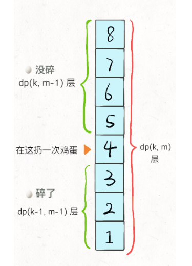

### 解题思路
李永乐老师讲的太好了！可以先看一遍。

[复工复产找工作？先来看看这道面试题：双蛋问题](https://www.bilibili.com/video/BV1KE41137PK)

对于第一个蛋，扔到``i``层，有两种结果，一种``碎``，一种``没碎``:
* 1、碎了的话，还剩下``K-1``个蛋，还有``i-1``层要验
* 2、没碎的话，还剩下``K``个蛋，还有``N-i``层要验证

因为，咱们要算最坏情况下的次数，而这个蛋是否坏我们是不知道的。所以，咱们从上面1/2两种情况里选比较``大``的。

接下来就是，怎么确定这个``i``呢？我们要选一个最好的``i``来扔，虽然之前蛋在``i``层会不会坏我不知道，但是，哪个``i``对我们最有利，我们还是可以算出来的。

怎么算？

遍历就完事了。

### 代码
```golang
var memo [][]int

func superEggDrop(K int, N int) int {
	memo = make([][]int, K)
	for k := range memo {
		memo[k] = make([]int, N)
		for k1 := range memo[k] {
			memo[k][k1] = -1
		}
	}
	return drop(K, N)
}

func drop(eggNum, floorNum int) int {
	if eggNum == 1 {
		return floorNum
	}
	if floorNum == 0 {
		return 0
	}
	if memo[eggNum-1][floorNum-1] != -1 {
		return memo[eggNum-1][floorNum-1]
	}
	result := math.MaxInt32
	for i := 1; i <= floorNum; i++ {
		result = int(math.Min(float64(result),
			math.Max(float64(drop(eggNum-1, i-1)), float64(drop(eggNum, floorNum-i)))+1))
	}
	memo[eggNum-1][floorNum-1] = result
	return result
}
```
这样提交的结果就是，``超时``了。
#### 二分法改进
不如把寻找``i``的方法改为二分法，写出如下代码，这次OK了。
```golang
var memo [][]int

func superEggDrop(K int, N int) int {
	memo = make([][]int, K)
	for k := range memo {
		memo[k] = make([]int, N)
		for k1 := range memo[k] {
			memo[k][k1] = -1
		}
	}
	return drop(K, N)
}

func drop(eggNum, floorNum int) int {
	if eggNum == 1 {
		return floorNum
	}
	if floorNum == 0 {
		return 0
	}
	if memo[eggNum-1][floorNum-1] != -1 {
		return memo[eggNum-1][floorNum-1]
	}
	result := math.MaxInt32
	left, right := 1, floorNum
	for left <= right {
		mid := (left + right) / 2
		broken, notBroken := drop(eggNum-1, mid-1), drop(eggNum, floorNum-mid)
		if broken > notBroken { // 碎的比完整的次数多，从碎的里面选
			right = mid - 1
			result = int(math.Min(float64(result), float64(broken+1)))
		} else {
			left = mid + 1
			result = int(math.Min(float64(result), float64(notBroken+1)))
		}
	}
	memo[eggNum-1][floorNum-1] = result
	return result
}
```
#### 再次改进
参考[经典动态规划：高楼扔鸡蛋（进阶）](http://labuladong.gitbook.io/algo/dong-tai-gui-hua-xi-lie/gao-lou-reng-ji-dan-jin-jie)

改变memo的定义
```
memo[k][m] = n
# 当前有 k 个鸡蛋，可以尝试扔 m 次鸡蛋
# 这个状态下，最坏情况下最多能确切测试一栋 n 层的楼

# 比如说 memo[1][7] = 7 表示：
# 现在有 1 个鸡蛋，允许你扔 7 次;
# 这个状态下最多给你 7 层楼，
# 使得你可以确定楼层 F 使得鸡蛋恰好摔不碎
# （一层一层线性探查嘛）
```

代码为

```golang
func superEggDrop(K int, N int) int {
	memo := make([][]int, K+1)
	for k := range memo {
		memo[k] = make([]int, N+1)
	}
	i := 0
	for memo[K][i] < N {
		i++
		for j := 1; j <= K; j++ {
			memo[j][i] = memo[j][i-1] + memo[j-1][i-1] + 1
		}
	}
	return i
}
```