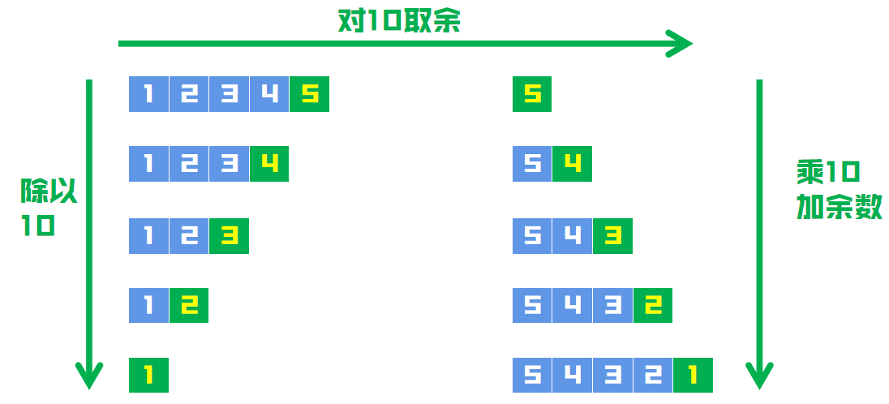

# 求翻转后的数字，看是否相同
### 解题思路
如题，先求翻转后的数字，看看是否和原数相同。

翻转数字方法如下：


* 1、不断通过``x``除10，使位数左移动，即个>十>百>千>万
* 2、对当前``x``取余，获取当前位的数字
* 3、使用当前位的数字，拼接颠倒的数字

### 代码
```
func isPalindrome(x int) bool {
	result := 0
	// 负数肯定不是回文数
	if x < 0 {
		return false
	}
	y := x
	for y != 0 {
		result = result*10 + y%10
		y = y / 10
	}
	return result == x
}
```

## 改进思路
### 解题思路
咱们其实可以不用把整个数字都翻转了在比较，翻转一半就够了。

那么怎么知道是否翻转了一半呢？

因为求翻转数的过程中，原始数字不断除10，反转后的数字不断乘10，
那么当原数字小于等于翻转后的数字时，意味着翻转一半了。

但是这时候由于我们没有算出整个数，就要考虑特殊的情况:如果数字的最后一位是 0，那么数字第一位必须也是0，满足条件的数字只有``0``本身
### 代码
```go
func isPalindrome(x int) bool {
	// 负数肯定不是回文数
    // 结尾是0，但是本身不是0的数，不是回文数
	if x < 0 || (x % 10 == 0 && x != 0) {
		return false
	}
	result := 0
	for x > result {
		result = result*10 + x%10
		x /= 10
	}
	return result == x || x == result / 10
}
```
