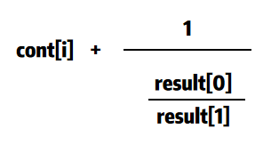
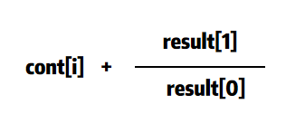
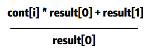

# 模拟写法
### 解题思路
* 1、初始化要得到的结果``result``，为``{cont[len(cont)-1], 1}``，
因为``cont``只有一个数字的时候,结果就是其本身
```
cont[len(cont)-1] / 1 = cont[len(cont)-1]
```
* 2、从倒数第二个数字开始，从后向前遍历``cont``
* 3、每一次都要倒置``result[0]/result[1]``，再加上``cont[i]``，即


```
// 交换
result[0], result[1] =  result[1], result[0]
result[0] = cont[i] * result[1] + result[0]
```



Go语言里面，可以合并为一步



```
result[0], result[1] = cont[i] * result[0] + result[1], result[0]
```

### 代码

```golang
func fraction(cont []int) []int {
	l := len(cont)
	result := []int{cont[l-1], 1}
	for i := l-2; i >= 0; i-- {
		result[0], result[1] = cont[i] * result[0] + result[1], result[0]
	}
	return result
}
```