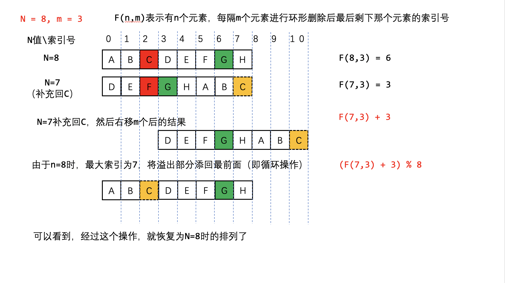

# 剑指 Offer 62. 圆圈中最后剩下的数字
> 原题链接：[剑指 Offer 62. 圆圈中最后剩下的数字](https://leetcode-cn.com/problems/yuan-quan-zhong-zui-hou-sheng-xia-de-shu-zi-lcof/)

## 约瑟夫问题
### 解题思路
#### 问题转换
然约塞夫问题就是用人来举例的，那我们也给每个人一个编号（索引值），每个人用字母代替

下面这个例子是N=8 m=3的例子

我们定义``F(n,m)``表示最后剩下那个人的索引号，因此我们只关系最后剩下来这个人的索引号的变化情况即可


从8个人开始，每次杀掉一个人，去掉被杀的人，然后把杀掉那个人之后的第一个人作为开头重新编号

* 第一次C被杀掉，人数变成7，D作为开头，（最终活下来的G的编号从6变成3）
* 第二次F被杀掉，人数变成6，G作为开头，（最终活下来的G的编号从3变成0）
* 第三次A被杀掉，人数变成5，B作为开头，（最终活下来的G的编号从0变成3）
* 以此类推，当只剩一个人时，他的编号必定为0！（重点！）
####  最终活着的人编号的反推

现在我们知道了G的索引号的变化过程，那么我们反推一下
从``N = 7``到``N = 8``的过程

如何才能将``N = 7`` 的排列变回到``N = 8`` 呢？

我们先把被杀掉的``C``补充回来，然后右移``m``个人，发现溢出了，再把溢出的补充在最前面

神奇了 经过这个操作就恢复了``N = 8`` 的排列了！



因此我们可以推出递推公式``f(8,3)=[f(7,3)+3]%8``

进行推广泛化，即``f(n,m)=[f(n−1,m)+m]%n``


### 代码
```go
func lastRemaining(n int, m int) int {
	result := 0
	// 最后一轮剩下2个人，所以从2开始反推
	for i := 2; i <= n; i++ {
		result = (result + m) % i
	}
	return result
}
```

## 模拟链表
### 解题思路
### 代码
java
```java
class Solution {
    public int lastRemaining(int n, int m) {
        ArrayList<Integer> list = new ArrayList<>(n);
        for (int i = 0; i < n; i++) {
            list.add(i);
        }
        int idx = 0;
        while (n > 1) {
            idx = (idx + m - 1) % n;
            list.remove(idx);
            n--;
        }
        return list.get(0);
    }
}
```
