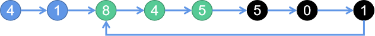

# 面试题 02.07. 链表相交
> 原题链接：[面试题 02.07. 链表相交](https://leetcode-cn.com/problems/intersection-of-two-linked-lists-lcci/)

## 解法一：首尾相接法
### 解题思路


将这两个链表首尾相连，然后检测这个链表是否存在环，如果存在，则两个链表相交，而环入口结点即为相交的结点



### 代码
```golang
func getIntersectionNode(headA, headB *ListNode) *ListNode {
	if headA == nil || headB == nil {
		return nil
	}
	curA := headA
	// 找到A的尾节点
	for curA.Next != nil {
		curA = curA.Next
	}
	// 将A尾巴和B头相连
	curA.Next = headB
	// 用快慢指针找到环的相交点
	slow, fast := headA, headA
	for fast != nil && fast.Next != nil {
		slow, fast = slow.Next, fast.Next.Next
		if slow == fast {
			break
		}
	}
	// 无相交点可以直接返回了
	if slow != fast {
		curA.Next = nil
		return nil
	}
	slow = headA
	for slow != fast {
		slow, fast = slow.Next, fast.Next
	}
	// 树的结构不能改变，这里做还原
	curA.Next = nil
	return slow
}
```
## 解法二：尾结点法
### 解题思路
如果两个链表相交，那么两个链表从相交点到链表结束都是相同的结点，
必然是``Y``字形

所以，判断两个链表的最后一个结点是不是相同即可。


如果两个链表的长度相等，你可以同时遍历两个链表。当两个链表的当前节点相同时，该节点即为相交节点。

若两个链表长度不同，则只需要“移除”或忽略较长链表超出的部分（图中为灰色节点）。该如何实现这一想法呢？如果两个链表的长度已知，那么从长度的差中，即可以得知需要移除多少节点。

如果两个链表的长度相等，你可以同时遍历两个链表。当两个链表的当前节点相同时，该节点即为相交节点。
* 1、即先遍历一个链表，直到尾部
* 2、再遍历另外一个链表，如果也可以走到同样的结尾点，则两个链表相交
* 3、这时记下两个链表的长度``lenA``、``lenB``
* 4、再遍历一次，长链表结点先出发前进``abs(lenA-lenB)``步
* 5、之后两个链表同时前进，每次一步，相遇的第一点即为两个链表相交的第一个点
```golang
func getIntersectionNode(headA, headB *ListNode) *ListNode {
	if headA == nil || headB == nil {
		return nil
	}
	curA, curB := headA, headB
	lenA, lenB := 0,0
	// 遍历headA/headB,找到其尾节点，并得到其长度
	for curA.Next != nil {
		curA = curA.Next
		lenA++
	}
	for curB.Next != nil {
		curB = curB.Next
		lenB++
	}
	// 尾巴都不相等，肯定不相交
	if curA != curB {
		return nil
	}
	// 让长的那个链表先行差距步数
	if lenA > lenB {
		for lenA - lenB > 0 {
			headA = headA.Next
			lenA--
		}
	}
	if lenB > lenA {
		for lenB - lenA > 0 {
			headB = headB.Next
			lenB--
		}
	}
	// 之后两者同时前行就可以得到相交位置
	for headA != headB {
		headA, headB = headA.Next, headB.Next
	}
	return headA
}
```